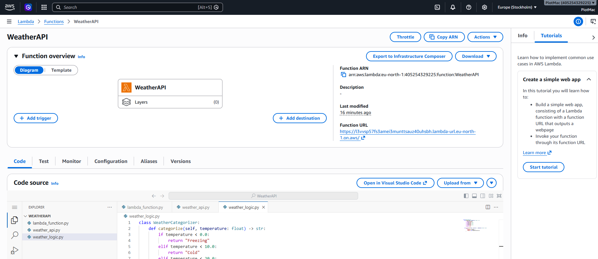
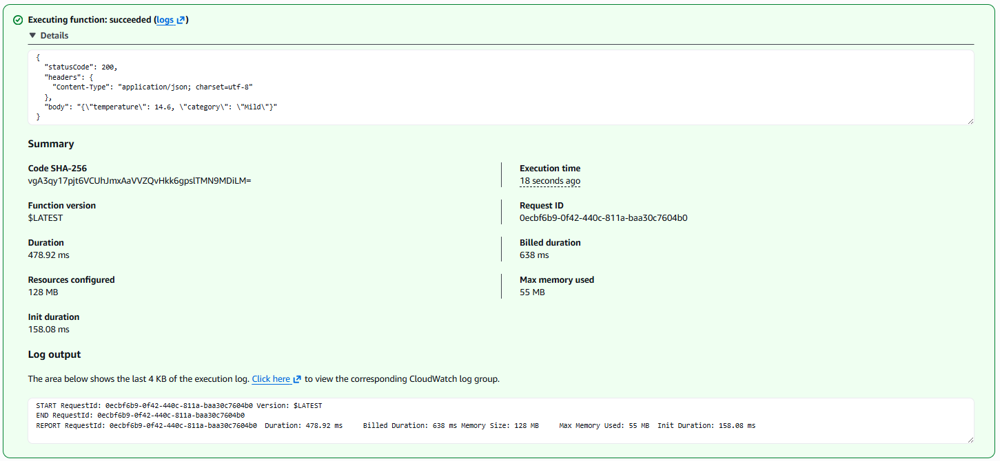
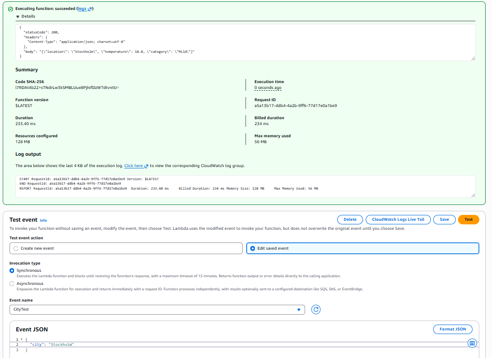
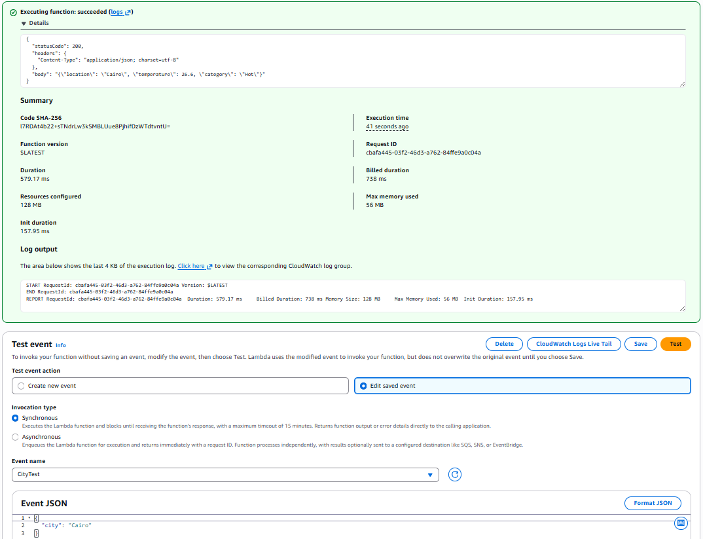
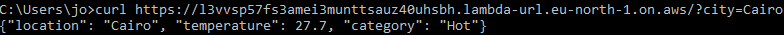
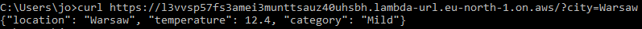
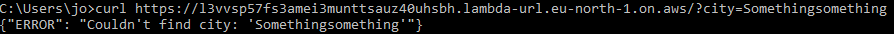
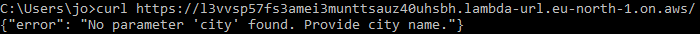

# Weather API - AWS Lambda

## TASK 1

### 1. Brief description of the solution
This project is a serverless application deployed on AWS Lambda using Python 3.x. The function retrieves the current temperature for Wrocław, Poland, using the publicly available Open-Meteo API. Based on the retrieved data, the application applies custom business rules to categorize the weather (e.g., "Mild", "Hot") and returns a structured JSON response to the client.

### 2. Explanation of key design decisions
The application was built with **Clean Architecture** and **Object-Oriented Design (OOD)** principles in mind, focusing on the Separation of Concerns. The codebase is divided into three distinct modules:
1. **`weather_api.py` (Infrastructure/Communication):** Defines a `WeatherProvider` interface and contains the `OpenMeteoProvider` class. It is responsible solely for external HTTP requests and data parsing.
2. **`weather_logic.py` (Business Logic):** Contains the `WeatherCategorizer` class, encapsulating the core rules (temperature thresholds) and response formatting.
3. **`lambda_function.py` (Orchestration):** The AWS entry point. It contains zero business logic. It simply acts as a coordinator: initializing the objects and passing data between them to format the final HTTP JSON response.

*Additional decision:* I chose to use Python's built-in `urllib` instead of the popular `requests` library. This eliminates the need for creating ZIP deployment packages with external dependencies, keeping the Lambda function lightweight and easy to maintain directly in the console for this basic implementation.

### 3. How the solution could be unit tested without calling the real API
Because the application uses Object-Oriented Design and Dependency Injection, testing it is straightforward and robust. 

To test the orchestrator (`lambda_function.py`) without making real HTTP requests, we don't even have to rely heavily on complex mocking libraries. We can simply create a "Fake" or "Mock" object that implements the `WeatherProvider` interface and inject it into our tests. By forcing this fake object to return specific values (e.g., `-5.0` or `30.0`), we ensure that our unit tests:
* Run fast and offline.
* Do not consume actual external API rate limits.
* Are deterministic (not affected by real-world weather changes).

### AWS Lambda Execution & Confirmation (Screenshots)

The `doc/` directory contains visual proof of the deployment:

### a. Lambda Creation Confirmation

### b. Test Execution Results

---

## TASK 2

### 1. Brief description of the solution
To meet the requirement of dynamically fetching weather for any given city, the codebase was extended while strictly adhering to the established Clean Architecture:
* **`lambda_function.py` (Orchestrator):** Modified to parse the AWS `event` object to extract the `city` input parameter. 
* **`weather_api.py` (Infrastructure):** The `OpenMeteoProvider` class was updated to handle a two-step communication process. It strictly encapsulates the geocoding logic (`_get_coordinates`) and exposes a single, clean public method (`get_weather(city_name)`).
* **`weather_logic.py` (Business Logic):** The `WeatherCategorizer` was updated to receive the resolved city name so it can be accurately reflected in the final output JSON.

### 2. Explanation of key design decisions
**The Geocoding Necessity:** The Open-Meteo weather API does not accept city names directly; it requires exact geographic coordinates. That is why I integrated the Open-Meteo Geocoding API. This solves the problem elegantly but required splitting the external communication into two sequential HTTP calls (Resolve City -> Fetch Weather). Thanks to encapsulation, the orchestrator doesn't need to know about this complexity—it simply calls `get_weather()`.

### 3. How the solution could be unit tested without calling the real API
Just like in Task 1, the Object-Oriented architecture allows us to test the orchestrator easily. 

We can configure our injected mock `WeatherProvider` to simulate both scenarios:
* **Success Path:** We set the mock's `get_weather()` method to return a dummy tuple (e.g., `("Wrocław", 15.0)`). This tests if the Lambda correctly processes and categorizes the data.
* **Error Path (404 Handling):** We force the mock's `get_weather()` method to raise a `ValueError("City not found")`. This allows us to instantly verify if our orchestrator catches the error and correctly formats the `HTTP 404` JSON response, entirely bypassing the real API.

### Dynamic Execution Evidence (Screenshots)
Below are sample test events configured in the AWS Console demonstrating successful execution, logic processing, and dynamic categorization for three different cities.

**a. Test Event - City 1 (Stockholm)**

**b. Test Event - City 2 (Barcelona)**

**c. Test Event - City 3 (Cairo)**

---

## TASK 3

To make the service accessible to external clients, I enabled the **AWS Lambda Function URL** feature. This acts as a dedicated HTTP endpoint for the Lambda function without the need to set up a full API Gateway, keeping the architecture simple and cost-effective.

* **Authentication:** Set to `NONE` to allow public, unauthenticated access via the web.
* **Code modification:** The `lambda_function.py` was modified to handle `event.get('queryStringParameters')`.

### Endpoint Details
* **Publicly Accessible URL:** `https://l3vvsp57fs3amei3munttsauz40uhsbh.lambda-url.eu-north-1.on.aws/`
* **HTTP Method:** `GET`
* **Query Parameter:** `city`

### Example Requests & Responses

Below are examples of how to interact with the API using a standard web browser or command-line tools (like `curl`), along with the expected JSON responses.

#### Scenario 1: Valid cities

#### Scenario 2: Invalid city

#### Scenario 3: No parameter provided

## TASK 4: Design Reflection

**Current Design:**
The current architecture strongly supports the addition of new weather providers due to the strict Separation of Concerns (Clean Architecture). By isolating the external HTTP communication within the `weather_api` module, the core business logic and the Lambda orchestrator remain completely agnostic to the data source. To add a new provider (e.g., AccuWeather), we would only need to create a new class or function that returns the temperature in the expected format, leaving the rest of the application untouched. The only current limitation is that the orchestrator is statically tied to the Open-Meteo implementation, meaning a code change is still required to swap them.

**Future Improvements:**
Given more time, I would improve the system by fully implementing the **Strategy Design Pattern** combined with Environment Variables, allowing the application to dynamically switch between weather providers without modifying the code (e.g., acting as a fallback if the primary API fails). Additionally, to improve performance and reduce external API rate limits, I would introduce a **Caching Layer** (e.g., using AWS DynamoDB or ElastiCache) to store temperature data for a specific city with a short TTL (Time-To-Live). Finally, I would transition from manual console deployments to **Infrastructure as Code (IaC)** using AWS SAM or Terraform.

